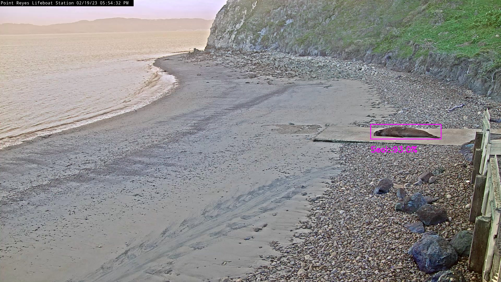

# Seal Detection

Pre-trained ML models to detect seals in images, and APIs to use the models.



## Local setup

It is recommended to create a new anaconda virtual environment using the following command.

```shell
conda create -n seal_det python=3.9
conda activate seal_det
conda install --file requirements.txt
```

## FastAPI Serving

The models can be served using a FastAPI server. The server allows the POSTing of image URLs and raw image (file uploads). The model to use is supplied as URL path parameters.

```shell
POST /{model_name}/{model_version}/upload - Image file upload endpoint
POST /{model_name}/{model_version}/url - Image URL endpoint
```

The server can be started with

```shell
uvicorn api:app
```

The server can be tested with the `test_api.py` file. It will save images to the `output` folder based on the `model` and `version` requested.

```shell
python test_api.py
```

The FastAPI server can also be served using Docker:

```shell
docker build -t seal_det_api .
docker run --gpus all --rm --name seal_detector -v $(pwd)/outputs/docker:/outputs -p 8000:8000 seal_det_api
```

And then tested the same as running it outside of Docker

```shell
python test_api.py
```

## Tensorflow Serving

The models can be served with Tensorflow Serving:

```shell
# Location of demo models
export MODEL_NAME="seal_detector"

# Start TensorFlow Serving container and open the REST API port
docker run -t --rm -p 8501:8501 \
    -v "$(pwd)/${MODEL_NAME}:/models/${MODEL_NAME}" \
    -e MODEL_NAME=${MODEL_NAME} \
    tensorflow/serving
```

The HTTP endpoint can then be used to pass in JSON image data and write out results to files. See the `test_tf_serving.py` file for an example.

## Stream Processing

The model can also be applied to a live stream using one of the `stream_*.py` files.

Run model version 2

```shell
python stream_effdet2.py
```

Run model version 3

```shell
python stream_effdet3.py
```
